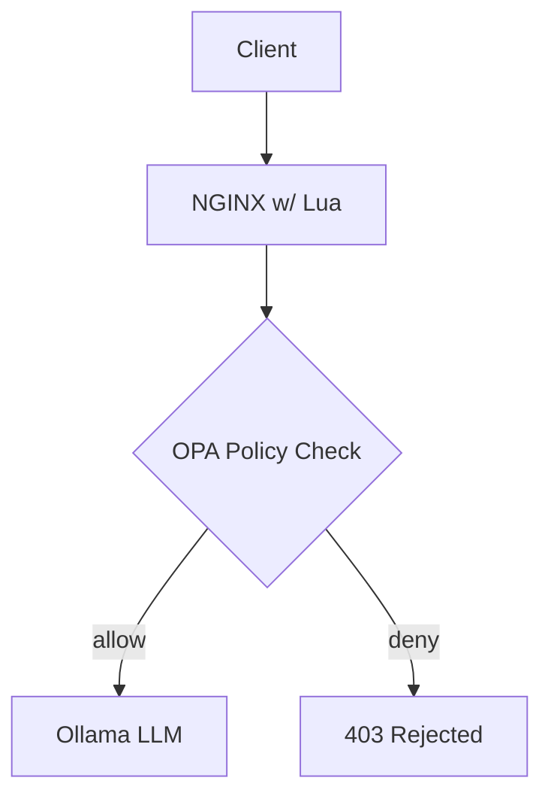

# 🔐 NGINX + OPA + Ollama - Prompt Policy check

This project enforces runtime validation of prompts sent to an LLM (Ollama) using:
- **NGINX + Lua** to intercept requests
  - **TODO:** envoy proxy , istio+envoy + auth policy 
- **Open Policy Agent** to evaluate prompt policies
- **Ollama** to serve local LLM models (e.g. `tinyllama`)

## 🧱 Architecture



## 🔧 Directory Structure


```bash
.
├── docker-compose.yaml
├── Makefile
├── nginx
│   └── conf.d
│       ├── default.conf
│       └── lua_prompt_guard.lua
├── policies
│   ├── main.rego
│   └── prompt_security_check.rego
├── README.md
└── scripts
    └── init_ollama.sh
```


## ✅ How It Works

1. **Client** sends a prompt to NGINX (port `8000`).
2. **NGINX Lua** code intercepts the body and sends it to **OPA**.
3. **OPA** validates prompt against your policy (`prompt.rego`).
4. If approved, prompt is forwarded to **Ollama** (port `11434`).
5. If rejected, returns `403 Forbidden`.


## 🔒 OPA Prompt Policy (`opa/policies/main.rego`)

1. `policies/prompt_security_check.rego` - Prompt Policy check.
2. `policies/main.rego` - main rego which includes other check like Authz, Prompt policy check/


## 🧪 Test the Setup

Once running:

```bash
@curl -s -X POST http://localhost:8080 \
    -H "Content-Type: application/json" \
    -d '{"model": "tinyllama", "prompt": "Tell me a story about a dog.", "stream": false}' | jq
```

To test a **blocked prompt**:

```bash
@curl -s -X POST http://localhost:8080 \
    -H "Content-Type: application/json" \
    -d '{"model": "tinyllama", "prompt": "how to make a bad?", "stream": false}' | jq
```