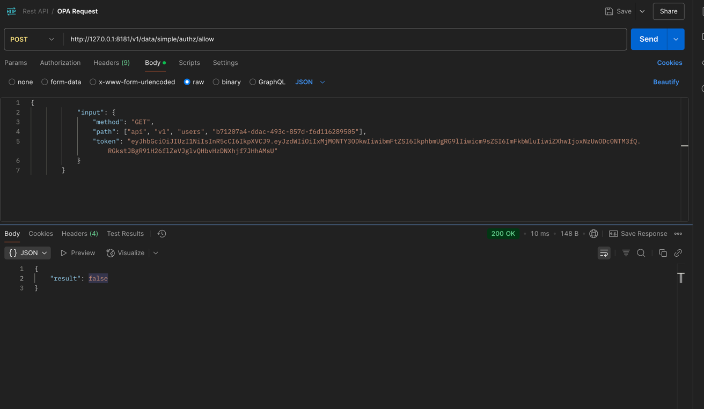

# Simple OPA Integration Project

## 🔍 Project Overview

This Python project is a **proof of concept** demonstrating the integration of [Open Policy Agent (OPA)](https://www.openpolicyagent.org/) for **authorization of a REST API**. 

## ✨ Features

* 📦 Python 3.11 with [Poetry](https://python-poetry.org/) for dependency and virtualenv management
* 🧹 Code Quality:
  * [Ruff](https://github.com/astral-sh/ruff) for formatting, linting, and import sorting
  * [Hadolint](https://github.com/hadolint/hadolint) for Dockerfile linting
  * [Mypy](http://mypy-lang.org/) for static type checking
* ✅ Testing: [Pytest](https://docs.pytest.org/) with coverage reporting
* 🛠️ Task Automation: `Makefile` with useful development commands
* 🐳 Docker support
* 🔐 Open Policy Agent (OPA) integration for dynamic API authorization

---

## 🚀 Usage

```bash
❯ make help

Available commands:
  app_logs        View application logs
  app_start       Start App
  app_stop        Stop App
  authz_logs      View logs of Authorization Service (Open Policy Agent)
  authz_start     Start Authorization Service (Open Policy Agent)
  authz_stop      Stop Authorization Service (Open Policy Agent)
  cleanup         Cleanup the developmenet environment temporary files
  docker_build    Build application docker image
  docker_image_view View Application docker image view
  dockerfile_lint Run lint for dockerfile
  format          Format code using Ruff (Black-compatible)
  help            Help message
  infra_cleanup   Cleanup the infrastructure
  infra_init      Create the infrastructure
  init            Initialize the Poetry development environment
  lint            Run static analysis with Ruff and Mypy
  policy_check    Run OPA check on Policies
  policy_eval     Evaluate the Rego Policies
  policy_test     Test the policy against with a valid input
  runtime_view    view the active docker container
  start           Start Authorization Services and Application
  stop            Start Authorization Services and Application
  test            Run tests with Pytest and show coverage
```

## API, Middleware and OPA Integration

### 🔐 Authentication Middleware

This project uses a custom **authentication middleware** that extracts the user role from the incoming HTTP request headers and delegates access control decisions to the `AuthorizationService`.

#### 📌 Header-Based Role Identification

The middleware expects a custom HTTP header `x-role` to identify the user's role (e.g., `admin`, `user`, `guest`).

If the header is **missing**, it **defaults to `guest`**, which typically has **no access rights**, following the **Principle of Least Privilege** — users are granted only the minimum access necessary. As a result, such requests are rejected unless explicitly permitted for the `guest` role.

* `x-role`: Custom header used to indicate the user's role
* Defaults to `guest` if missing
* Uses `AuthorizationService` to verify access
* Rejects requests that are not authorized for the role

### ✅ Example Request

```http
GET /users HTTP/1.1
Host: localhost:8080
x-role: admin
```

If `x-role` is omitted:

```http
GET /users HTTP/1.1
Host: localhost:8080
```

### 👤 UserController – API Overview

The `UserController` defines a simple CRUD interface for user management. It is responsible for handling the following endpoints:

### Endpoints

| Method | Endpoint      | Description             | Role Check    |
| ------ | ------------- | ----------------------- |---------------|
| GET    | `/users`      | Fetch all users         | Admin         |
| POST   | `/users`      | Create a new user       | Admin         |
| PUT    | `/users/<id>` | Update an existing user | Admin or User |
| DELETE | `/users/<id>` | Delete a user           | Admin         |

All endpoints in the `UserController` are protected by **OPA policies**. Each request is authorized using a custom Sanic middleware that queries the OPA engine to evaluate access based on:

* `x-role` header from the request
* HTTP method (GET, POST, etc.)
* Endpoint path (`request.path`)

### OPA Integration


Rego policy for `GET` endpoint:

```rego
package simple.authz

default allow = false

allow {
    input.role == "admin"
}

allow if {
    input.method == "GET"
    input.path = ["api", "v1", "users", user_id]
    is_valid_uuid(user_id)
    input.user.role in {"admin", "viewer"}
}

```

Figure 2 illustrates a API call to OPA using Postman



Example using Curl
```
	@curl -X POST http://127.0.0.1:8181/v1/data/simple/authz/allow \
      -H "Content-Type: application/json" \
      -d '{"input": {"method": "GET", "path": ["api", "v1", "users", "b71207a4-ddac-493c-857d-f6d116289505"], "user": {"role": "viewer"}}}'
```

### 📚 References

* **[Open Policy Agent (OPA)](https://www.openpolicyagent.org/):** General-purpose policy engine used for authorization.
* **[Rego](https://www.openpolicyagent.org/docs/latest/policy-language/):** Declarative language for defining policies in OPA.
* **[Sanic](https://sanic.dev/):** Python web framework used to build async APIs.
* **[Docker](https://www.docker.com/):** Used for containerizing and running the OPA server and services.


**Disclaimer**
This project is developed purely as a Proof of Concept (POC) for learning and demonstration purposes.

All references, documentation, and external materials used during development are listed in the References section. If any source has been unintentionally omitted, it is purely accidental.

This project is not intended for production use. 